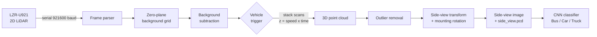

# LiDAR-Vehicle-Classification


LiDAR-based automatic vehicle detection and classification using 3D point-cloud processing, noise filtering, clustering, and Bird's Eye View (BEV) / side-view image generation.

A single **2D line-scan LiDAR** (LZR-U921) is mounted beside the lane. As a vehicle drives past, successive scans are **stacked along a time axis** to build a 3D point cloud, which is cleaned, rotated into a side profile, rendered as an image, and classified as **Bus, Car, or Truck** by a CNN.

---

## Table of Contents

- [Key Features](#key-features)
- [System Overview](#system-overview)
- [Hardware](#hardware)
- [How It Works](#how-it-works)
- [The Serial Buffer Problem and Fix](#the-serial-buffer-problem-and-fix)
- [Classification Model](#classification-model)
- [Repository Structure](#repository-structure)
- [Installation](#installation)
- [Usage](#usage)
- [Configuration Reference](#configuration-reference)
- [Known Limitations and Roadmap](#known-limitations-and-roadmap)
- [License](#license)
- [Acknowledgements](#acknowledgements)

---

## Key Features

- **Real-time capture** from the LZR-U921 over serial (921,600 baud) on Windows or Raspberry Pi.
- **Robust zero-plane calibration**: per-beam median with MAD outlier rejection builds a background grid, so only objects entering the scan area are extracted.
- **Automatic vehicle triggering** with idle-timeout, and (in `master_control.py`) a persistence check to reject noise.
- **Point-cloud cleaning** with statistical and radius outlier removal (Open3D).
- **Mounting-angle correction**: full 3D rotation (pitch/roll/yaw) to compensate for a tilted sensor.
- **Dynamic-frame image generation**: the side-view image is cropped to the vehicle with padding rather than a fixed window.
- **Background processing thread** so heavy computation does not block serial reading.
- **Offline tools** for recording, filtering, visualising, and rendering point clouds.
- **Bus / Car / Truck classifier** (MobileNetV2-based) with 94.62% test accuracy.

---

## System Overview



---

## Hardware

| Item | Details |
|---|---|
| Sensor | LZR-U921 2D LiDAR |
| Field of view | 96° (start angle -48°) |
| Angular resolution | 0.3516° (274 points per scan) |
| Interface | Serial, 921,600 baud |
| Host | Windows PC (development) or Raspberry Pi (deployment) |
| Mounting | Beside the lane, scan plane roughly vertical, with a small pitch offset corrected in software |

### Serial packet format

| Field | Size | Notes |
|---|---|---|
| SYNC | 4 bytes | `FC FD FE FF` |
| SIZE | 2 bytes | Little-endian, length of the message body |
| CMD | 2 bytes | `50011` = Measured Distance Information |
| Plane number | 1 byte | Skipped by the parser |
| Distances | 2 bytes each | Little-endian `uint16`, millimetres |
| CHK | 2 bytes | Checksum (skipped) |

---

## How It Works

1. **Zero-plane calibration.** With the scan area empty, several thousand frames are recorded. For each beam the robust median distance (MAD filter) is computed and converted to an (x, y) point. Points are hashed into a 5 cm grid, which becomes the *background matrix*. In `master_control.py` each cell is also dilated by one neighbouring cell to absorb jitter.
2. **Background subtraction.** Each live scan point is mapped to the grid. Points that fall in a background cell are discarded; the rest belong to a moving object. This follows the background-matrix idea of Wu et al. (2018).
3. **Trigger and stacking.** When the number of foreground points in a scan exceeds a threshold, capture starts. Each scan is given a depth `z = elapsed_time × vehicle_speed`, turning 2D scans into a 3D cloud. Capture ends after a period with no foreground points (idle timeout).
4. **Cleaning.** Statistical outlier removal (25 neighbours, std ratio 0.8) followed by radius outlier removal (12 points within 6 cm) removes dust, flying pixels, and isolated noise.
5. **Side-view transform.** Axes are remapped so the time axis becomes vehicle length, then a pitch/roll/yaw correction (`R = Rz · Ry · Rx`) compensates for sensor mounting angle.

   | Raw axis | Side-view axis |
   |---|---|
   | z (time) | X, vehicle length |
   | y | Y, height |
   | -x | Z, depth from sensor |

6. **Image generation.** The rotated cloud is projected onto a 5 mm/pixel grid, cropped to the vehicle bounding box plus 20 cm padding, flipped so the ground is at the bottom, and lightly blurred. Output is saved as `side_view_image.png`.
7. **Classification.** The image is resized to 224×224 and passed to the CNN classifier.

Each detected vehicle is written to its own folder:

```
vehicle_YYYYMMDD_HHMMSS/
├── side_view.pcd          # cleaned, rotated point cloud
└── side_view_image.png    # rendered profile image
```

---

## The Serial Buffer Problem and Fix

### Problem

The original distance calculation was:

```python
z = (time.time() - start_capture_time) * VEHICLE_SPEED_MPS
```

This assumes the system clock at the moment a frame is *read* reflects when it was *captured*. On a Raspberry Pi that assumption breaks:

- The LiDAR sends frames at a fixed rate.
- The Pi occasionally stalls (Wi-Fi or OS tasks), so frames pile up in the serial buffer.
- When the Pi resumes, it reads many frames almost instantly, and they all receive nearly the same timestamp.
- Result: points stack at the same `z`, producing a vertical **black strip** in the image.

### Solution: two-layer protection

**Layer 1: Virtual time.** Stop trusting the Pi clock per frame and trust the sensor's fixed scan rate instead.

```python
SCAN_PERIOD_S = 0.030          # 30 Hz sensor -> one scan every 30 ms
virtual_time += SCAN_PERIOD_S  # advance once per frame pulled from the buffer
z = virtual_time * VEHICLE_SPEED_MPS
```

Buffered frames now receive evenly spaced `z` values regardless of when they are read.

**Layer 2: Multi-core processing.** Work is split across two CPU cores so LiDAR reading is never blocked.

| Core | Role | Priority |
|---|---|---|
| A | Real-time capture: read serial frames, update `virtual_time`, detect vehicles, store points | High, must never pause |
| B | Background processing: statistical filtering, rotation, `.pcd` and image saving (slow I/O) | Lower |

> [!NOTE]
> The scripts currently in this repository use a background **thread** and `time.time()`. The virtual-time and multiprocessing changes described above should be ported into `master_control_rpi.py` / `master_control.py`. Update or remove this note once that is done.

---

## Classification Model

Vehicle images are classified with a transfer-learning model trained on Google Colab.

| | |
|---|---|
| Classes | Bus, Car, Truck |
| Input | 224×224 side-view image |
| Backbone | MobileNetV2 (edge-detection features), GlobalAveragePooling2D |
| Imbalance handling | Class weights |

**Training data**

| Class | Images |
|---|---|
| Car | 2,930 |
| Bus | 203 |
| Truck | 84 |

**Results** (186 held-out images)

| Metric | Value |
|---|---|
| Test accuracy | **94.62%** |
| Test loss | 0.2087 |
| Misclassified | 10 / 186 |

**Error analysis:** 4 images were entirely new vehicle types, 1 small truck resembled a car, and one truck sub-type was absent from the training set. The remaining errors are attributed to the small truck dataset. Collecting more truck and bus samples is the main route to improvement.

> [!NOTE]
> The training notebook and trained weights are not yet included in this repository.

---

## Repository Structure

| File | Purpose |
|---|---|
| **Main pipeline** | |
| `master_control_rpi.py` | Raspberry Pi pipeline: calibration, detection, cleaning, 3D rotation correction, dynamic-frame side-view image |
| `master_control.py` | Threaded-serial variant with persistence-based triggering, dilated background, and a pre-trigger frame buffer (fixed 2 m × 2 m image window) |
| `code.py` | Variant of `master_control_rpi.py` with different tuning parameters |
| `old.py` | Earlier baseline version, kept for reference |
| **Recording tools** | |
| `reader.py` | Capture raw scans and save a single `.pcd` |
| `zero_plane_recorder.py` | Record an empty scene and save a clean zero-plane `.pcd` (MAD median + neighbour-jump filter) |
| `commonPoints_reader.py` | Record a background using a persistence filter, keeping only grid cells seen in a minimum fraction of frames |
| `stacked_reader.py` | Record speed-corrected stacked scans into a `.pcd` |
| `test.py` | Measure the incoming frame rate and serial buffer health |
| **Offline processing** | |
| `extract_profile.py` | GUI tool: subtract a zero-plane `.pcd` from a stacked `.pcd` (10 cm grid) |
| `outlier_remover.py` | GUI tool: statistical and radius outlier removal on a `.pcd` |
| `image_generator.py` | GUI tool: render a `.pcd` to a depth-shaded image with an adjustable X-axis rotation |
| `image_stretcher.py` | Stretch the right half of an image to correct length distortion |
| **Visualisation** | |
| `visualizer.py` | Open3D viewer, step through `.pcd` files with the arrow keys |
| `visualizer_rpi.py` | Lightweight Matplotlib viewer for Raspberry Pi (downsampled) |

---

## Installation

```bash
git clone https://github.com/enrohit/LiDAR-Vehicle-Classification.git
cd LiDAR-Vehicle-Classification

python -m venv .venv
source .venv/bin/activate        # Windows: .venv\Scripts\activate

pip install pyserial numpy opencv-python open3d matplotlib
```

The GUI tools use Tkinter. On Raspberry Pi OS / Debian: `sudo apt install python3-tk`.

For model training, TensorFlow/Keras is also required.

**Serial port permissions (Linux / Raspberry Pi)**

```bash
sudo usermod -a -G dialout $USER      # then log out and back in
# or, temporarily:
sudo chmod 666 /dev/ttyUSB0
```

---

## Usage

### 1. Set the serial port and vehicle speed

Edit the configuration block at the top of the script you are running:

```python
SERIAL_PORT = '/dev/ttyUSB0'   # Windows: 'COM8'
VEHICLE_SPEED_KMPH = 25.0      # must match real vehicle speed
```

> The vehicle length in the image is `speed × time`, so an incorrect `VEHICLE_SPEED_KMPH` stretches or compresses vehicles along their length. Set it to the speed at which vehicles actually pass the sensor.

### 2. Run the live pipeline

```bash
python master_control_rpi.py
```

1. **Keep the scan area clear** while the system calibrates.
2. When `System Live` is printed, vehicles passing the sensor are detected and processed automatically.
3. Outputs are saved in `vehicle_<timestamp>/`.

### 3. Offline workflow (optional)

```bash
python zero_plane_recorder.py   # record empty scene, Ctrl+C to save
python stacked_reader.py        # record a pass-by, Ctrl+C to save
python extract_profile.py       # pick zero plane + stacked file -> filtered_object.pcd
python outlier_remover.py       # clean the filtered cloud
python image_generator.py       # render an image (set ROTATION_ANGLE_X first)
python visualizer.py            # inspect .pcd files in 3D
```

### Checking the sensor frame rate

```bash
python test.py
```

Prints the measured frame rate and serial buffer occupancy each second. Use it to confirm the sensor rate before setting the virtual-time step.

---

## Configuration Reference

Values below are from `master_control_rpi.py`.

| Parameter | Default | Description |
|---|---|---|
| `SERIAL_PORT` | `/dev/ttyUSB0` | Serial device |
| `BAUD_RATE` | `921600` | Serial speed |
| `START_ANGLE` / `ANGULAR_RES` | `-48.0` / `0.3516` | Sensor geometry (degrees) |
| `CALIBRATION_FRAMES` | `4000` | Frames used to build the zero plane |
| `GRID_CELL_SIZE` | `0.05` | Background grid cell (m) |
| `MIN_RANGE_M` / `MAX_RANGE_M` | `0.10` / `2.25` | Range limits used in calibration (m) |
| `VEHICLE_SPEED_KMPH` | `5` | Assumed constant vehicle speed |
| `TRIGGER_THRESHOLD` | `50` | Foreground points needed to trigger |
| `IDLE_TIMEOUT` | `0.8` | Seconds without foreground points before the vehicle is considered passed |
| `GRID_RES` | `0.005` | Image resolution (m per pixel) |
| `ROTATION_X_DEG` | `25.0` | Pitch correction |
| `ROTATION_Y_DEG` / `ROTATION_Z_DEG` | `0.0` / `0.0` | Roll / yaw correction |
| `FRAME_PADDING_M` | `0.2` | Padding around the vehicle in the image |
| `MIN_IMAGE_DIM_M` | `1.0` | Minimum image size (m) |

---

## Known Limitations and Roadmap

- Constant-speed assumption: vehicles that accelerate or brake during the pass are distorted along their length.
- Small truck dataset (84 images); trucks are the weakest class.
- Single side-mounted sensor: only one side profile is captured.
- Planned: port virtual-time and multiprocessing fixes into the main scripts.
- Planned: add the training notebook, trained weights, and an inference script.
- Planned: measure vehicle speed directly (for example with a second scan plane) instead of assuming it.

---

## License

Released under the [MIT License](LICENSE).

---

## Acknowledgements

- The background-matrix filtering approach follows Wu et al. (2018), as referenced in `extract_profile.py`.
- Point-cloud processing uses [Open3D](http://www.open3d.org/); image processing uses [OpenCV](https://opencv.org/).
